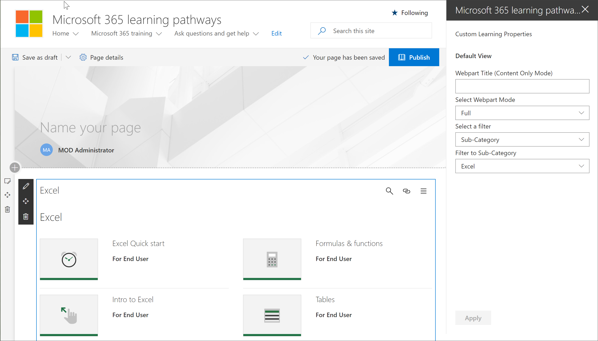

# Agregar y editar el elemento Web de aprendizaje personalizado

El aprendizaje personalizado le proporciona la flexibilidad necesaria para agregar el elemento Web de aprendizaje personalizado a una página de SharePoint y, a continuación, filtra el contenido del elemento Web para cumplir con los objetivos de aprendizaje de la página. Por ejemplo, puede crear una página "cambiar a OneDrive" y, a continuación, agregar el elemento Web y configurarlo para mostrar listas de reproducción personalizadas de migración de OneDrive creadas especialmente para la organización.

1.  Haga clic en el icono de engranaje de SharePoint y, a continuación, haga clic en **Agregar una página**.
2.  Haga clic en **Agregar una nueva sección (+)** en el lado izquierdo de la página y, a continuación, haga clic en **una columna**.
3.  Haga **+** clic en y seleccione elemento Web **de aprendizaje personalizado para Office 365** . 

## Edición del elemento Web de aprendizaje personalizado
Puede editar el elemento Web de aprendizaje personalizado para mostrar todo el contenido de aprendizaje personalizado disponible o una categoría, subcategoría, lista de reproducción o activo específicos. 

1.  Haga clic en **Editar elemento Web**.

2. En el panel Propiedades de aprendizaje personalizado, filtre el elemento Web por lo siguiente. 

- Modo de elemento Web: completo
- Filter: Subcategoría
- Subcategoría: Excel

3. La página debería tener ahora un aspecto similar a la siguiente imagen: 

## Agregar un título y publicar la página
1. En el área de título de la página, escriba "crear su propia experiencia".
2. Haga clic en el icono **Editar elemento Web** en el área de título, seleccione **sin formato** en **diseño**y, a continuación, cierre el panel **propiedades** .
3. Haga clic en **publicar**.
