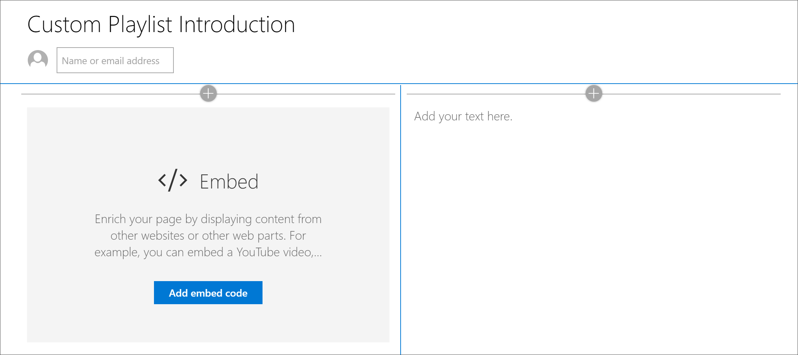

# Crear páginas de SharePoint para listas de reproducción personalizadas

Una de las características únicas de las rutas de aprendizaje es la capacidad de crear listas de reproducción que se ensamblan a partir de activos de Microsoft y de activos de SharePoint que cree. En este ejemplo, crearemos una página de SharePoint antes de crear una lista de reproducción. La capacidad de crear listas de reproducción a partir de páginas de SharePoint ofrece una variedad de oportunidades para crear páginas con los elementos web disponibles de Microsoft o su organización. Por ejemplo, una lista de reproducción puede incluir una página de SharePoint con vídeos incrustados de YouTube, un formulario creado a partir de Office 365 Forms o un informe de Power BI incrustado. En este ejemplo, le mostraremos cómo crear una página con el elemento web Embed y el elemento web Text.  

## Crear una página de SharePoint para una lista de reproducción personalizada

1. Haga clic en el **icono** de Engranaje de SharePoint y, a continuación, haga clic en Agregar **una página**.
2. Haga **clic en Agregar una nueva sección (+)** en el lado izquierdo de la página y, a continuación, haga clic en Dos **columnas** para el diseño de sección.
3. En la columna izquierda, haga clic en + y, a continuación, haga clic en el elemento web **Insertar.** 
4. En la columna derecha, haga clic en +y, a continuación, haga clic en el **elemento** web Texto. La página debe tener este aspecto.

### Agregar un vídeo y texto de YouTube

1. En el explorador, ve a YouTube. En este ejemplo, busque "Qué es Office 365: las mejores aplicaciones de productividad de Microsoft".
2. Haz clic en el vídeo para reproducirlo, luego pausalo y, a continuación, haz clic con el botón secundario en él. 
3. Haga **clic en Copiar código de** inserción y, a continuación, vuelva a la página de SharePoint. 
4. Haga **clic en Agregar código de** inserción en el elemento web **Insertar** y, a continuación, agregue el código desde el vídeo de YouTube.
5. Vuelva a la página de YouTube y copie el **texto Descripción** del vídeo. 
6. Vuelva a la página de SharePoint, seleccione el **elemento** web Texto y, a continuación, copie el texto del vídeo de YouTube.
7. Seleccione el **icono Editar elemento web** en el área Título de la página de SharePoint y, a continuación, asigne a la página el nombre "Introducción a la lista de reproducción personalizada". 
8. En **Diseño**, seleccione **Sin formato** y, a continuación, cierre el panel de propiedades de la **región** de título. La página ahora debería tener un aspecto parecido al siguiente. 

### Publicar la página

- Seleccione el **botón** Publicar. Ahora ya está listo para agregar esta página de SharePoint a la lista de reproducción personalizada. 