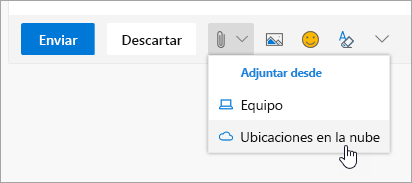

# Colaboración con compañeros de trabajo

Es 2:00 P.M. y la hora para colaborar con compañeros de trabajo. Office 365 proporciona en mejores oportunidades para la colaboración, permitir a los equipos para que funcionen conjuntamente en un número de formas. 

## Herramientas
- Microsoft Teams
- Office Online
- OneNote
- SharePoint & OneDrive
- 
## Lista de comprobación para la colaboración con compañeros de trabajo
- Crear o unirse a una Team Microsoft para colaborar
- Crear y compartir archivos de OneDrive 
- Creación de co-autoría en Office 365 
- Usar datos adjuntos en la nube

## Crear o unirse a una Team Microsoft para la colaboración

Microsoft Teams y canales son lugares donde las personas pueden colaborar mediante el uso compartido de archivos, realizar un seguimiento de los elementos de acción de equipo y mucho más. Cada Teams Microsoft tiene una integración en un sitio de SharePoint, un bloc de notas de OneNote y otros activos. Este servicio de Office 365 mejor se usa para las personas que trabajan juntas con frecuencia en proyectos compartidos o de los resultados. 

## Compartir archivos desde su OneDrive
Los archivos que se han guardado en OneDrive para la empresa se pueden compartir con cualquier persona ya sea desde el explorador o aplicaciones de escritorio de Office 365, como Word o Excel. Es posible compartir con personas que utilizan su nombre, el alias o la dirección de correo electrónico de la compañía. 

## Creación de co-autoría en Office 365
CO-creación es cuando se trabaja simultáneamente con compañeros de trabajo en el mismo archivo. Esto es posible en las versiones basadas en web de las aplicaciones de Office 365 principales y en las versiones de escritorio de dichas aplicaciones de Office 2016 en adelante.  Ahorrar tiempo y funcionan juntos en el mismo documento y Office sincronizarán esos cambios por usted, incluso si se encuentre sin conexión. 

## Usar datos adjuntos en la nube: detener un correo electrónico a esa hoja de cálculo.
¿Cuántas veces ha tenido a extensiones para la versión correcta de un documento cuando estaba asociado a un correo electrónico? Ahora en Office 365 puede compartir un vínculo al archivo, denominado un dato adjunto en la nube, de manera que todos los usuarios está editando la misma versión.  Puede elegir para enviar un vínculo y si las personas pueden ver o editar el archivo. 

